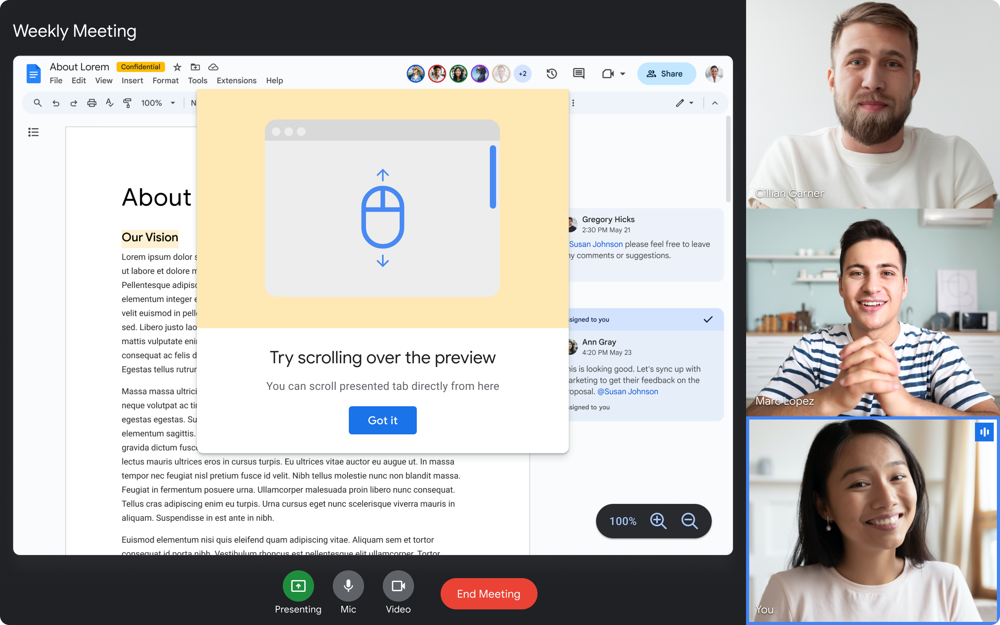

# Captured Surface Control

## In a nutshell

We introduce a new Web API that allows Web applications to:

1. Forward wheel events to a captured tab.
2. Read/write the zoom level of a captured tab.

## Motivation

Nearly all video-conferencing Web applications offer their users the ability to share a browser tab, a native window, or screen. Many of these applications also show the local user a "preview tile" with a video of the captured [display surface](https://www.w3.org/TR/screen-capture/#dfn-display-surface).

All these applications suffer from the same drawback - if the user wishes to interact with a captured tab or window, the user must first switch to that surface, taking them away from the video-conferencing application. This presents some challenges:

- The user can't see the captured app and the videos of remote users at the same time unless they use [Picture-in-Picture](https://wicg.github.io/document-picture-in-picture/) or separate side-by-side windows for the video conference tab and the shared tab. On a smaller screen, this could be difficult.
- The user is burdened by the need to jump between the video conferencing app and the captured surface.
- The user loses access to the controls exposed by the video conferencing app while they are away from it; for example, an embedded chat app, emoji reactions, notifications about users asking to join the call, multimedia and layout controls, and other useful video conferencing features.
- The presenter cannot delegate control to remote participants. This leads to the all too familiar scenario where remote users ask the presenter to change the slide, scroll a bit up and down, or adjust the zoom level.

The Captured Surface Control APIs address these problems.

## Terminology

A **"capturing application"** is an application which has called [getDisplayMedia()](https://www.w3.org/TR/screen-capture/#dom-mediadevices-getdisplaymedia), leading the browser to present a "media-picker" dialog to the user, from which the user will have chosen to capture a tab, a window or a screen. The surface selected by the user is the **"captured surface"**. If that surface was a tab, we call the Web application currently loaded in that tab the **"captured application"**. If the user's chosen surface is a window, we designate the associated native application as the **"captured application"**.

## General API shape

We extend [CaptureController](https://www.w3.org/TR/screen-capture/#capturecontroller) to support a limited set of low-risk actions.

In the code samples provided in this document, assume the following preliminaries:

```js
const controller = new CaptureController();
const stream = await navigator.mediaDevices.getDisplayMedia({ controller });
const previewTile = document.querySelector("video");
previewTile.srcObject = stream;
```

### Prelude: Permission Prompt

We distinguish between write-access and read-access APIs.

- The write-access APIs introduced here, `forwardWheel()` and `setZoomLevel()`, are gated by a new [Permissions Policy](https://www.w3.org/TR/permissions-policy-1/#permissionspolicy) called `"captured-surface-control"`.
- Our read-access APIs are innocuous and are threfore left ungated.

With most browsers' interpretation of [Permissions Policy](https://www.w3.org/TR/permissions-policy-1/#permissionspolicy), the first time an origin invokes either `forwardWheel()` or `setZoomLevel()`, the browser shows a [permission prompt](https://w3c.github.io/permissions/#prompt-the-user-to-choose). How long this permission is persisted is up to the browser, with typical durations being "forever" or "for the current browsing session".

Before displaying a permission prompt to the user, the app must solicit a user gesture. If the app wants to show zoom-in/out buttons ahead of time, then the user gesture is a given. But if the app wants to first inform the user about these new features, and provide clearer context about the ensuing permission prompt, then the app could include an onboarding experience that features a "start" button of some sort, after which it will invoke a write-access API in a no-op manner, producing the prompt but not causing any action thereafer. An example is:

<p align="center">
  
</p>

Code to support this could look as follows:

```js
document.getElementById("startButton").onclick = async () => {
  try {
    const hasPermission = await navigator.permissions.query({
      name: "captured-surface-control",
    });
    if (hasPermission.state !== "granted") {
      await controller.setZoomLevel(controller.getZoomLevel());
    }
  } catch (e) {
    console.log(`Error: ${e}`);
  }
};
```

### Scroll forwarding

#### forwardWheel()

To faciliate scrolling of captured surfaces, we extend `CaptureController` as follows:

```webidl
  partial interface CaptureController {
    Promise<undefined> forwardWheel(HTMLElement? element);
  };
```

Using `forwardWheel()`, a capturing application can forward subsequent [wheel events](https://developer.mozilla.org/en-US/docs/Web/API/Element/wheel_event) from a local element, such as the preview tile, to the captured surface's viewport. The browser determines the coordinates of the event relative to the origin of the target element, then produces a corresponding event on the captured surface at corresponding coordinates, after scaling. This forwarded event is indistinguishable to the captured application from direct user interaction.

`forwardWheel()` is subject to a permissions policy, which might involve a permission prompt. The method returns a `Promise` that is resolved if the connection is successfully made, and rejected otherwise (for example, if the user rejects the permission prompt).

Sample usage:

```js
try {
  await controller.forwardWheel(previewTile);
} catch (e) {
  console.log(`Error: ${e}`);
}
```

It is possible to use `forwardWheel()` with any type of element. This allows applications to forward gestures from elements other than the `HTMLVideoElement` itself. Thanks to this useful property of the API, applicationss can draw text, annotations and emoji-reactions over the video preview tile, and the experience will still work as the user expects.

To stop the forwarding of wheel events, applications can invoke `forwardWheel(null)`.

Forwarding will also stop if the capture-session ends for whatever reason.

## Zoom controls

To faciliate read-access and write-access to a caputred surface's zoom, we extend `CaptureController` as follows:

```webidl
partial interface CaptureController {
  sequence<long> getSupportedZoomLevels();
  long getZoomLevel();
  Promise<undefined> setZoomLevel(long zoomLevel);
  attribute EventHandler oncapturedzoomlevelchange;
};
```

#### getSupportedZoomLevels()

Returns a list of zoom-levels which could theoretically be set, depending on the user agent implementation and the type of surface shared. This zoom level is represented as a percentage of the "default zoom-level", which is defined as 100%. The list is guaranteed to be monotonically increasing, and is guaranteed to contain the value `100`.

Note that user agents may trim the list to a reasonable length. If the need arises, this function may in the future be extended to receive an argument with the maximum number of entries the application is interested in receiving.

#### getZoomLevel()

Returns the current zoom-level of the captured surface.

Sample usage:

```js
  currentZoomLabel.textContent = `${controller.getZoomLevel()}%`;
```

This method is not gated by a permission policy.

This method is guaranteed to return a value that appears in the set of values returned by `getSupportedZoomLevels()`.

#### setZoomLevel(value)

Given an integer `value` that appears in `getSupportedZoomLevels()`, sets the zoom-level of the captured surface to `value`.

`setZoomLevel()` is subject to a permissions policy, which might involve a permission prompt. This method returns a promise. If the permission policy is in the `'granted'` state, or if it is in the `'prompt'` state and the user does grant it once prompted, the promise is resolved; otherwise, it is rejected.

One way to use this method is to present UX elements to the user:

<p align="center">
  
</p>

Code backing up these controls could look like:

```js
  const zoomIncreaseButton = document.getElementById("zoomInButton");
  zoomIncreaseButton.addEventListener("click", async (event) => {
    const supportedZoomLevels = controller.getSupportedZoomLevels();
    const currentZoomLevelIndex = supportedZoomLevels.indexOf(controller.getZoomLevel());
    if (currentZoomLevelIndex >= supportedZoomLevelsz.length - 1) {
      return;
    }
    const newZoomLevel = supportedZoomLevels[currentZoomLevelIndex + 1];
    try {
      await controller.setZoomLevel(newZoomLevel);
    } catch (e) {
      console.log(`Error: ${e}`);
    }
  });
```

#### oncapturedzoomlevelchange

Users can change the captured application's zoom-level by interacting with the user agent, the captured application, or possibly by additional means. If the capturing application is displaying any user-facing controls and UX element, such as an indicator of the current zoom-level, or buttons to increase/decrease zoom, then the capturing application will want to listen to such externally-triggered zoom-changes, and reflect them in the capturing application's own UX. The `oncapturedzoomlevelchange` event handler helps with that.

Sample usage:

```js
controller.addEventListener("capturedzoomlevelchange", (event) => {
  const zoomLevel = controller.getZoomLevel();

  // Update label.
  zoomLevelLabel.textContent = `${zoomLevel}%`;

  // Update controls.
  const supportedZoomLevels = controller.getSupportedZoomLevels();
  const currentZoomLevelIndex = supportedZoomLevels.indexOf(zoomLevel);
  zoomIncreaseButton.disabled = currentZoomLevelIndex >= supportedZoomLevels.length - 1;
  zoomDecreaseButton.disabled = currentZoomLevelIndex <= 0;
});
```

## Security and Privacy Considerations

### Permission prompts

Permission prompts are currently used as mitigations for Web Platform capabilities which are arguably even riskier than those presented in this document - clipboard access, geolocation, mic- and camera-access, and most notably, screen-capture itself. It follows that, if the prompt can be clear enough for the user, it should be a sufficient mitigation for the risks associated with the API surfaces we introduce.

### Risks and mitigations

#### User confusion

To obtain initial permission to use the API, and to keep on using it, an application does not need to show the user a video representation of the surface under control via a `<video>` element. Even if it does show such a `<video>` element, it is not guaranteed that the `<video>` element is connected to a [MediaStreamTrack](https://developer.mozilla.org/en-US/docs/Web/API/MediaStreamTrack) derived from the surface being captured, or that the MediaStreamTrack being used is not manipulated in some ways, e.g. using Breakout Box.

A browser-mediated connection between the captured surface and the permission prompt is infeasible. Instead, we rely on careful phrasing of the permission prompt as the mitigation for these risks.

#### Access to pixels beyond those originally intended by the user

When a user chooses to share a tab or a window, it might be that they only intended to share with the app the content immediately visible. The APIs we introduce will allow the capturing application to gain access to yet more content. This is both the core risk of the API as well as its intended use.

We mitigate using a permission prompt. The downsides are as usual:

- Dialog fatigue and the risk of the user just approving so as to be done with it.
- Impaired usability of Web apps that now require additional toil of their users.
- Difficulty in communicating to the user precisely what permission they are asked to grant.
- Difficulty in communicating to the user why such a permission could be risky.

The downsides are all known, and should be considered against those associated with alternative approaches (e.g. Video Portal).

#### Access at a time not controlled by the user

Discussed [below](#transient-activation).

#### Side effects

Gestures like wheel and pinch might have effects other than scrolling the page. If we consider some modern dating applications, we note that "swiping right" could have far-reaching consequences, and might even culminate in matrimony. However, the author of this document argues that the permission prompt is sufficient here, as it was for other Web Platform capabilities.

#### Scrolling third-party iframes when self-capturing

Applications that are capturing their own tab can load arbitrary third-party content in iframes and scroll it, thereby either gaining access to new content of their choosing, or producing arbitrary side effects. The mitigation of the permission prompt is still presented as sufficient here, as is the unlikelihood of third-party content only being sensitive after scrolling. If necessary, in the future, it is possible to also remove the ability to control the current tab.

### Transient activation

If transient activation is not required before each individual invocation of the APIs introduced by this document, then once the initial permission is obtained, the API can be used at any time, possibly even while the user is away from the device and cannot observe the effects of their change.

We argue that requiring transient activation is not desirable, as it renders impossible some legitimate use-cases, without actually contributing significantly to security.

#### Legitimate use cases blocked by transient activation requirement

Consider the following legitimate use case:

1. The local user participates in a video-conferencing session and chooses to share a tab.
2. Through interaction with the browser’s permission prompt, the local user allows scrolling and zooming of the captured tab by the video-conferencing application.
3. Through interaction with the video-conferencing application, the user allows a specific remote participant to scroll the captured tab - when a remote user sends a request to scroll, the request gets translated by the local application to a sendWheel() invocation.
4. The remote user can now control a local presentation, removing the need for the remote user to repeatedly ask the local user - "next slide, please." This is a major boon to such applications, where this is a critical user journey.

#### Insufficiency of transient activation requirement to protect the user

On the one hand, consider the following _potential attack_:

1. Obtain the user’s permission to capture another tab.
2. Use arbitrary user gestures to scroll the captured tab and change its zoom-level.

While executing the aforementioned attack, either avoid presenting a preview-tile to the user, or show a frozen preview-tile containing an older frame, hiding from the user the scrolling of the captured tab.

#### Conclusion

It is arguable that the legitimate use case described above is risky. We argue that it’s up to the application to only deploy it according to the local user’s genuine intentions.

**However**, user agents need to ensure that while a user is actively interacting with a captured tab, the capturing tab would not be able to concurrently zoom and scroll the captured tab, which would be confusing and frustrating for the user even in non-malicious settings. Due to the complexity of specifying and implementing this, Chrome's initial implementation of this API will only allow the capturing application to scroll/zoom while the capturing application is focused. The first draft of the spec will pose this as a requirement, but this may be changed at a later time.

## Potential future extensions

### Extension to additional gestures
At the moment, the API allows forwarding of wheel events. In the future, other gestures might be considered, such as pinch.

Note that forwarding of such events as `"click"` is NOT foreseen.

## Alternatives considered

### Rejected alternative: Communication with the captured application
We have considered the alternative of providing a mechanism for the capturing application to communicate with the captured application, **asking** it to scroll or change its zoom level. This alternative was deemed wholly insufficient - solutions that require opt-in by the captured application, would fail to work for the majority of capturer/capturee combinations due to absent opt-in, thereby failing to solve the problem.

Note that there are other good reasons to support communication between the capturing and captured application, and that both **structured communication** (e.g. "next slide" and "previous slide") as well as **unstructured communication** (e.g. `postMessage(anything)`) has its merits. However, that is a different solution, useful for a different set of problems.

### Rejected alternative: Zoom-control through browser-level UX
We have considered leaving it up to the user agent to present zoom-controls controls to the user. However, this alternative approach would not solve the problem sufficiently.
- Capturing applications need zoom-controls to be discoverable, which often means placing them inside of the viewport, in a position that is congruent with the rest of the application-level controls. For some capturing applications, this means overlaying zoom-controls over the video preview tile; for other capturing applications, this means placing them alongside pre-existing app-level controls.
- Applications need to customize the look and feel of controls to fit together with the rest of the application.

It bears mentioning that, while we provide an API for app-level control of zoom, this does *not* stop user agents from providing such controls as well.

### Rejected alternative: Forwarding of gestures based on browser heuristics
Heuristics are imperfect - they often fail to trigger when desired, or trigger when not desired. Browser vendors are free to try their hand at developing such heuristics, but we believe it is essential that the Web platform include a mechanism for Web applications to explicitly trigger the functionality introduces by Captured Surface Control. (Note that this is not mutually-exclusive with heuristics.)

## Common questions

### What about Picutre-in-Picture?

[Document Picture-in-Picture](https://wicg.github.io/document-picture-in-picture/) presents an alternative partial solution to some of the problems addressed by Captured Surface Control. Given the different trade-offs chosen, some applications/users might prefer PiP, while other would prefer Captured Surface Control.

Benefits of PiP:

- No additional new APIs required.
- Captured surface fully interactive (as opposed to the limited set of actions afforded by Captured Surface Control).
- Captured surface available in its original resolution.

Benefits of CSC:

- All elements of the capturing application presented in their original size and are fully interactive. (Consider the challenges of fitting a chat box into the PiP.)
- Application has control of layout of remote participants videos and the captured-surface's preview tile.
- Local user can delegate some actions to remote users (through the mediation of the application).

It is expected that users intending to engage in significant interaction with the presented content would prefer PiP or other alternatives, while users who only need brief interactions to adjust scrolling and zooming would prefer CSC.

### What about Video Portal?

An alternative approach, currently labeled "Video Portal", has been discussed, for example in the [following slides deck](https://docs.google.com/presentation/d/1RIRPAg-M3pQYTFqL0rDGBIl8bQvLAzq122lWUF5JIy8/edit#slide=id.g1df86d70a44_0_25). This approach strikes yet _another_ balance, giving control over the captured surface to the local user rather than to the application. On the one hand, this means that almost any action could be allowed; on the other, it means that all the power rests in the local user's hands, and cannot be delegated from the user to the application. We see this approach as a possible _complementary_ approach that may be pursued separately from CSC.

## Uncommon questions

### What about blur?

Should a captured tab be unblurred before receiving `wheel` events? That's an open question for now.

### How does the zoom-level correspond to CSS zoom?

It is not currently clear that it does, but we're investigating the issue in light of [recent activity](https://github.com/w3c/csswg-drafts/issues/5623#issuecomment-1646125737) on that front.
